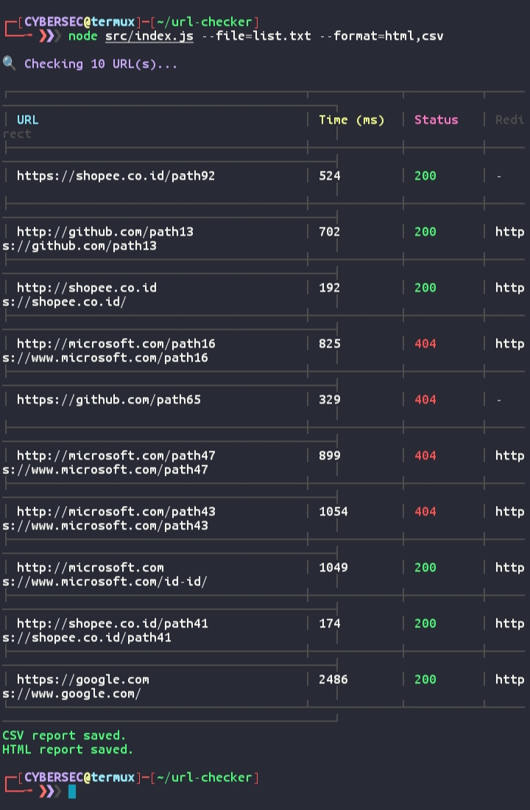

# URL Checker

Tool sederhana untuk mengecek status dan respon waktu dari satu atau banyak URL/domain.  
Mendukung output ke format **HTML**, **CSV**, dan **JSON**.  
Cocok untuk monitoring website atau audit domain secara cepat dari terminal.

## ✨ Fitur
- 🔍 Cek status code HTTP (200, 404, 500, dll)
- ⏱ Catat waktu respon server
- 📦 Output laporan ke **HTML**, **CSV**, dan **JSON**
- 📂 Input dari parameter langsung, file `.txt`, atau URL random
- 📊 Tampilan tabel rapi di terminal

## 📦 Instalasi
Pastikan **Node.js** sudah terinstall di sistem kamu.  
Di Termux, kamu bisa install dengan:
```
pkg install nodejs git
````

Clone repository ini:

```
git clone https://github.com/frhndevweb/url-checker.git
cd url-checker
```

Install dependency:

```
npm init -y
npm install yargs axios cli-table3
```

## 🚀 Cara Penggunaan

### Cek URL langsung

```
node src/index.js --urls=shopee.co.id,frhndevweb.my.id --format=html,csv --limit=5
```

### Cek dari file daftar URL

Url custome sendiri di src/config.js
```
shopee.co.id
frhndevweb.my.id
google.com
```

Lalu jalankan:

```
node src/index.js --file=list.txt --format=html,csv
```

### Cek URL random

```
node src/index.js --count=5 --format=html,csv
```

## 📂 Struktur Project

```
url-checker/
│
├── src/
│   ├── index.js       # Entry point aplikasi
│   ├── config.js      # Pengaturan default
│   ├── utils.js       # Fungsi pembantu
│   ├── checker.js     # Pengecekan URL
│   └── report.js      # Pembuatan laporan
│
├── reports/           # Hasil laporan HTML/CSV/JSON
└── package.json
```

## 📸 Preview



## 📜 Lisensi

MIT License © 2025 [frhndevweb](https://github.com/frhndevweb)
